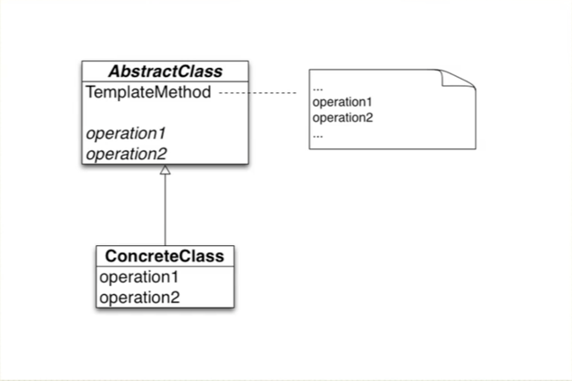
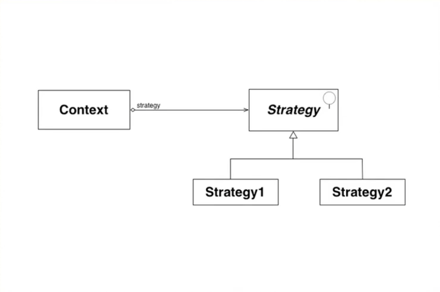
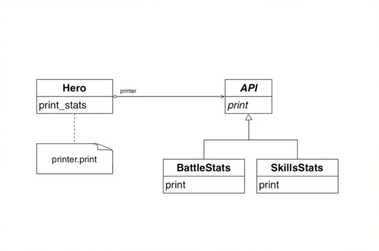

# Implement common design patterns with ruby

##Template method pattern

###What's the template method pattern?
> Define the skeleton of an algorithm in an operation, deferring some steps to subclasses. Template method lets subclasses redefine certain steps of an algorithm without changing the algorithm's structure.

Template method pattern is based on inheritance techology, it's a kind of class behavioral pattern.

We call those steps as basic method. Template method has one or more basic methods. If some basic methods are simple and not mutable, we could put them into super class, and mutable basic methods into subclasses, then we could implement different behavioral in special subclass.

Let's see the follow class implementation:

	class Hero
	  attr_reader :damage, :abilities

		def initialize(occupation = nil)
		  case occupation
		  when "warrior"
			 @damage, @abilities = 15, [:strike]
		  when "mage"
			@damage, @abilities = 7, [:magic_arrow]
		  else
			@damage, @abilities = 10, []
		  end
	    end

	    def attack
		  "Attacked dealing #{damage} damage"
	    end
    end

    warrior = Hero.new("warrior")
    puts warrior.attack
    mage = Hero.new("mage")
    puts mage.attack
    other = Hero.new
    puts other.attack
    

So, if we are going to add other occupations, then we have to duplicate the when statement. Firstly, we could use inheritance to refactor the above implement:

    class Hero
	  attr_reader :damage, :abilities

	  def initialize(occupation = nil)
		@damage, @abilities = 10, []
	  end

	  def attack
		"Attacked dealing #{damage} damage"
	  end
    end

    class Warrior < Hero
	  def initialize(occupation = nil)
		@damage, @abilities = 15, [:strike] 
	  end
    end

    class Mage < Hero
	  def initialize(occupation = nil)
		@damage, @abilities = 7, [:magic_arrow] 
	  end
    end

    warrior = Warrior.new
    puts warrior.attack
    mage = Mage.new
    puts mage.attack
    other = Hero.new
    puts other.attack
    
If we have other occupation, we could define a new occupation class. but if super class Hero initialize method has other processing, then subclasses have to implement it, such as other_processing method.

    def initialize(occupation = nil)
      other_processing 
	  @damage, @abilities = 10, []
	end

Here we could make initialize as template method, and we focus on mutable place(damage, abilities)

	class Hero
	  attr_reader :damage, :abilities

	  def initialize(occupation = nil)
		other_processing
		@damage, @abilities = set_damage, set_abilities
	  end

	  def attack
		"Attacked dealing #{damage} damage"
	  end

	  def other_processing
	  end

	  def set_damage
		10
	  end

	  def set_abilities
		[]
	  end
    end

    class Warrior < Hero
	  def set_damage
		15
	  end

	  def set_abilities
		[:strike]
	  end
    end

    class Mage < Hero
	  def set_damage
		7
	  end

	  def set_abilities
		[:magic_arrow]
	  end
    end

    warrior = Warrior.new
    puts warrior.attack
    mage = Mage.new
    puts mage.attack
    other = Hero.new
    puts other.attack
    
The set_damage and set_abilities methods are basic method, and Hero's initialize method is template method. It defines intilization sequence(firstly, invokes other_processing, sencondly invokes set_damage, and lastly invokes set_abilities).
We could add another template method(greet)

    class Hero
	  attr_reader :damage, :abilities

	  def initialize(occupation = nil)
		other_processing
		@damage, @abilities = set_damage, set_abilities
	  end

	  def attack
		"Attacked dealing #{damage} damage"
	  end

	  def other_processing
	  end

	  def set_damage
		10
	  end

	  def set_abilities
		[]
	  end

	  def greet
		greet = ["Hello"]
		greet << special_greet
		greet
	  end

	  def special_greet
		raise "Subclass need to implement special_greet method"
	  end
    end

    class Warrior < Hero
	  def set_damage
		15
	  end

	  def set_abilities
		[:strike]
	  end

	  def special_greet
		"I'm a warrior, and I will fight until dead."
	  end
    end

    class Mage < Hero
	  def set_damage
		7
	  end

	  def set_abilities
		[:magic_arrow]
	  end
    end

    warrior = Warrior.new
    puts warrior.attack
    puts warrior.greet
    
If subclasses do not implement special_greet method, the program will raise runtime error. Finally, let's look at the UML demostration:

##Strategy Pattern

###What's the strategy pattern
>Define family of algorithms, encapsulate each one, and make them interchangable. Strategy lets algorithm vary independently from clients that use it.

>策略模式把对象本身和运算规则区分开来，其功能非常强大，因为这个设计模式本身的核心思想就是面向对象编程的多形性的思想。

适用场景

- 许多相关的类仅仅是行为有异。 “策略”提供了一种用多个行为中的一个行为来配置一个类的方法。即一个系统需要动态地在几种算法中选择一种。
- 需要使用一个算法的不同变体。例如，你可能会定义一些反映不同的空间 /时间权衡的算法。当这些变体实现为一个算法的类层次时 ,可以使用策略模式。
- 算法使用客户不应该知道的数据。可使用策略模式以避免暴露复杂的、与算法相关的数据结构。
-  一个类定义了多种行为 , 并且这些行为在这个类的操作中以多个条件语句的形式出现。将相关的条件分支移入它们各自的Strategy类中以代替这些条件语句。

设计图如下:

模式描述:

- 环境类(Context):用一个ConcreteStrategy对象来配置。维护一个对Strategy对象的引用。可定义一个接口来让Strategy访问它的数据。
- 抽象策略类(Strategy):定义所有支持的算法的公共接口。 Context使用这个接口来调用某ConcreteStrategy定义的算法。
- 具体策略类(ConcreteStrategy):以Strategy接口实现某具体算法。

模式优点:

- 相关算法系列: Strategy类层次为Context定义了一系列的可供重用的算法或行为。 继承有助于析取出这些算法中的公共功能。
- 提供了可以替换继承关系的办法: 将算法封装在独立的Strategy类中使得你可以独立于其Context改变它，使它易于切换、易于理解、易于扩展。
- 消除了一些if else条件语句: 将行为封装在一个个独立的Strategy类中消除了这些条件语句。含有许多条件语句的代码通常意味着需要使用Strategy模式。
- 实现的选择: Strategy模式可以提供相同行为的不同实现。客户可以根据不同时间 /空间权衡取舍要求从不同策略中进行选择。

模式缺点：

- 客户端必须知道所有的策略类，并自行决定使用哪一个策略类
- Strategy和Context之间的通信开销 ：有时Context会创建和初始化一些永远不会用到的参数。如果存在这样问题 , 那么将需要在Strategy和Context之间更进行紧密的耦合。
- 策略模式将造成产生很多策略类：使用享元模式将一些公共状态存放在Context上，减少对象数量

示例:

	class Hero
	  attr_reader :damage, :health, :skills

	  def initialize
		@damage = 10
		@health = 5
		@skills = [:stealth, :driving, :intimidation]
	  end

	  def print_state(status = nil)
		if status == :skills
			skills.inject(""){|result, skill| result + skill.to_s.capitalize + "\n"}
		else
			"Damage: #{damage}\n Health: #{health}\n"
		end
	  end
    end

    hero = Hero.new
    print hero.print_state
    print hero.print_state(:skills)
    
以上是打印默认状态和skill状态，如果要打印其他状态(status存在分支)，那么需要添加elsif分支判断。这里使用template method模式是不适合的，因为需要继承。目前没有一个具体的子类(Hero子类)需要打印状态，状态是没有子类的。这里使用Strategy模式,让具体的状态打印自己的信息, 将打印状态的行为代理(Delegate)给具体的实现算法的类

	class Hero
	  attr_reader :damage, :health, :skills
	  attr_accessor :printer

	  def initialize(printer)
		@damage = 10
		@health = 5
		@printer = printer
		@skills = [:stealth, :driving, :intimidation]
	  end

	  def print_state(status = nil)
        printer.print(self)
	  end
    end

    class BattleState
	  def print(context)
		"Damage: #{context.damage}\n Health: #{context.health}\n"
	  end
    end

    class SkillsState
	  def print(context)
		context.skills.inject(""){|result, skill| result + skill.to_s.capitalize + "\n"}
	  end
    end

    hero1 = Hero.new(BattleState.new)
    puts hero1.print_state

    hero2 = Hero.new(SkillsState.new)
    puts hero2.print_state
    
Hero类与BattleState, SkillsState还是紧耦合的(printer.print(self), self导致耦合)。以下实现松耦合:

	class Hero
	  attr_reader :damage, :health, :skills
	  attr_accessor :printer

	  def initialize(printer)
		@damage = 10
		@health = 5
		@printer = printer
		@skills = [:stealth, :driving, :intimidation]
	  end

	  def print_state
        printer.print(damage, health, skills)
	  end
     end

    class BattleState
	  def print(damage, health, skills)
		"Damage: #{damage}\n Health: #{health}\n"
	  end
    end

    class SkillsState
	  def print(damage, health, skills)
		skills.inject(""){|result, skill| result + skill.to_s.capitalize + "\n"}
	  end
    end
    
让print_state更加灵活，使其可以接受block

	def print_state
      if block_given?
		yield(damage, health, skills)
	  else
        printer.print(damage, health, skills)
      end
	end
	
	hero3 = Hero.new(BattleState.new)
    result = hero3.print_state do |damage, health, skills|
	  "Damage: #{damage}\nNumber of skills:#{skills.size}"
    end
    puts result
    #=================>
    #Damage: 10
    #Number of skills:3

下面结合Template method模式:

	class Hero
	  attr_reader :damage, :health, :skills
	  attr_accessor :printer

	  def initialize(printer)
		@damage = 10
		@health = 5
		@printer = printer
		@skills = [:stealth, :driving, :intimidation]
	  end

	  def print_state
		if block_given?
		  yield(damage, health, skills)
		else
          printer.print(damage, health, skills)
        end
	  end
     end

    class HTMLPrinter
	  # Template method patter
	  def print(damage, health, skills)
		html = header
		html += content(damage, health, skills) 
		html += footer
	  end

	  def header
		"<html>"
	  end

	  def footer
		"</html>"
	  end

	  def content(damage, health, skills)
		raise "You must implement content method"
	  end
    end

    #这里可以继承HTMLPrinter具体的子类
    class BattleState < HTMLPrinter
	  def content(damage, health, skills)
		"Damage: #{damage}\n Health: #{health}\n"
	  end
    end

    class SkillsState < HTMLPrinter
	  def content(damage, health, skills)
		skills.inject(""){|result, skill| result + skill.to_s.capitalize + "\n"}
	  end
    end

    hero = Hero.new(BattleState.new)
    puts hero.print_state
    
下图是上述示例的具体描述

